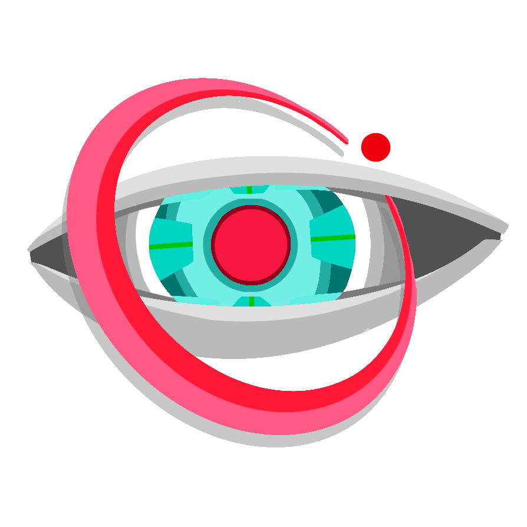

<div align="center">



# AutoPTZ

**AI-driven PTZ camera tracking — detect people, lock onto a target, and move the camera to follow them automatically.**

[Installation](docs/installation.md) · [Configuration](docs/configuration.md) · [Performance](docs/performance.md) · [Building](docs/building.md) · [Architecture](docs/architecture.md) · [Troubleshooting](docs/troubleshooting.md)

</div>

---

AutoPTZ is a cross-platform desktop app (native Qt Widgets / PySide6) that runs
a real-time vision pipeline per camera — **detect → track → re-identify → pose →
aim → drive PTZ** — and sends smooth pan/tilt/zoom commands so a PTZ camera keeps
the chosen person framed. It is built for live production: multi-camera, stable
target identity across occlusions, and graceful degradation when a model or
device is missing (it always keeps live preview).

## Highlights

- **Multi-camera** — each camera runs its own worker; identities stay stable per
  camera with no cross-camera state bugs.
- **Identity-gated tracking** — click a person to target them; optional face
  recognition + appearance ReID re-bind the right person after occlusions.
- **Smooth PTZ control** — motion prediction, one-euro smoothing, PD + velocity
  feed-forward, an internal framing quiet zone, fixed zoom by default, and
  hold-on-loss behavior.
- **Runs anywhere, fast** — ONNX Runtime picks the best accelerator per platform
  (Apple CoreML, NVIDIA TensorRT/CUDA, Windows DirectML, Intel OpenVINO, CPU)
  with per-EP tuning (FP16, persistent TensorRT engine cache, full graph
  optimization). See [Performance](docs/performance.md).
- **PTZ backends** — VISCA over USB, VISCA over IP, ONVIF, and NDI.
- **In-app updates** — checks GitHub Releases and downloads the matching asset for
  your OS to launch the installer/new AppImage. Stable builds by default; opt into
  pre-releases under **Help → Updates**.

## Quick start (from source)

Requires **Python 3.12+**.

```bash
git clone https://github.com/AutoPTZ/autoptz
cd autoptz

# Create a venv at the PROJECT ROOT (not inside autoptz/)
python3.12 -m venv .venv
source .venv/bin/activate        # Windows: .venv\Scripts\activate

# Full stack (detection + tracking + UI), editable source checkout:
python tools/install.py --editable

python -m autoptz                # launch the app
python -m autoptz --selftest     # verify the foundations and exit
```

Use **Engine → Models...** to cache the detector tiers and pose model in
the platform app-data dir. Without required models, AutoPTZ disables the affected
feature controls and still keeps live preview available where possible. Missing
detector tiers are not fetched on switch unless automatic model downloads are
enabled in that window.

### Picking your accelerator

`tools/install.py` detects the OS/GPU and prints every pip command before it
runs it. Use `--dry-run` to review the plan. Static requirements files cannot
inspect CUDA/TensorRT, so you can still force the ONNX Runtime wheel explicitly:

```bash
python tools/install.py --dry-run
python tools/install.py --accelerator nvidia --editable
python tools/install.py --accelerator openvino --editable
python tools/install.py --accelerator cpu --editable
```

Only one `onnxruntime*` wheel can be installed at a time — see
[Performance](docs/performance.md).

## Installers

Pre-built installers are published on the
[Releases page](https://github.com/AutoPTZ/autoptz/releases): a macOS `.dmg`, a
Windows installer (`.exe`), and a Linux `AppImage`. To build them yourself see
[docs/building.md](docs/building.md).

After install, **Help → Updates → Check Now…** downloads the matching OS asset,
starts it, and closes AutoPTZ so the update can finish. If a release is missing
your OS asset, AutoPTZ opens the release page instead.

## Documentation

| Doc | What's in it |
| --- | --- |
| [Installation](docs/installation.md)   | From source + pre-built installers, per platform. |
| [Configuration](docs/configuration.md) | Every tuning knob: detector tier, detect interval, framing, smoothing, PTZ gains. |
| [Performance](docs/performance.md)     | Cross-platform device/precision matrix + the `ep_compare` benchmark. |
| [Building](docs/building.md)           | PyInstaller bundles → DMG / Windows installer / AppImage. |
| [Architecture](docs/architecture.md)   | Module map and the per-frame data flow. |
| [Troubleshooting](docs/troubleshooting.md) | Common issues (no boxes, wrong camera, slow tracking). |
| [Contributing](CONTRIBUTING.md)        | Dev setup, lint/type/test gates, branch policy. |

## License And Models

AutoPTZ is licensed under the GNU Affero General Public License v3.0. See
[LICENSE.md](LICENSE.md) and [NOTICE.md](NOTICE.md) for third-party model and
optional dependency notices.
